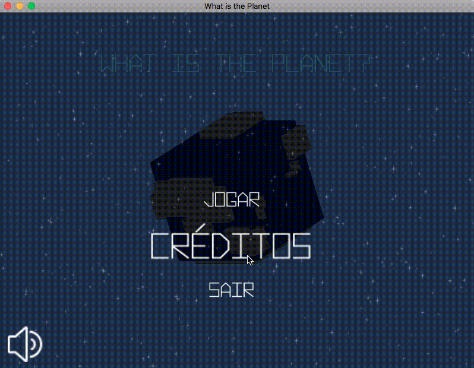

# Projeto Integrador Extra

  Data Limite: 10/03/2017
  
  [Detalhes do Desenvolvimento](doc/what-is-the-planet.pdf)

  [GDD](doc/gdd.pdf)

  [Release](https://github.com/humbertodias/unity-projeto-integrador-extra/releases)
  

# TODO

  1. O aluno deve desenvolver a fase de um jogo utilizando a UNITY 
  2. Deve descrever as Regras do Jogo 
  3. Deve ter vitória e derrota
  4. pelo menos 2 desafios 
  5. Menu de Start, Pause, Derrota, Vitória 
  6. Áudio 
  7. Todos os elementos do jogo devem ser desenvolvidos pelo aluno.

# DONE

  

### 1. Engine

	Utilizamos a versão 5.5.2.1f1 Personal da Unity.

### 2. Regras

	As regras do jogo, estão no 
[GDD](doc/gdd.pdf)

### 3. Vitória x Derrota

	Vitória, o jogador deve derrotar todas as torre e lacaios do inimigo.
	
	Derrotado, se todos suas torres e lacaios forem destruídos.

### 4. Desafios

	Foram criadas duas fases

### 5. Start, Pause, Derrota e Vitória
	
	Start com o logo da produtora.
		
	Pause, foi feito com Time.timeScale=0f.
		
	Idem para derrota e vitória

### 6. Áudio

	Audio/sfx com efeitos sonoros.
	
	Audio/music com músicas de fundo.

### 7. Feitos pelo Aluno

	Feito.