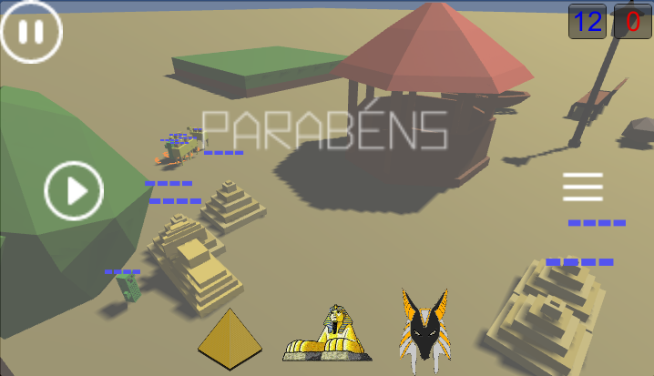
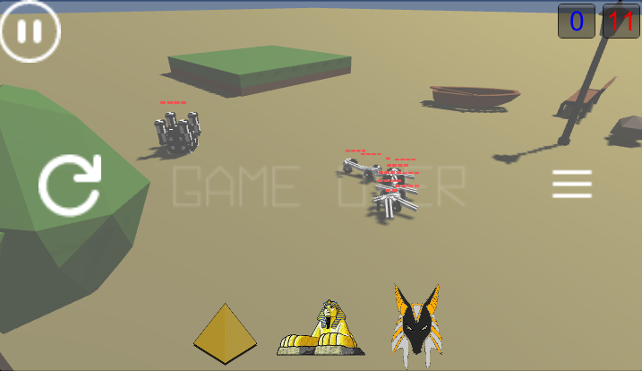

# unity-projeto-integrador-extra

  Data Limite: 10/03/2017

# TODO

  1. O aluno deve desenvolver a fase de um jogo utilizando a UNITY 
  2. Deve descrever as Regras do Jogo 
  3. Deve ter vitória e derrota
  4. pelo menos 2 desafios 
  5. Menu de Start, Pause, Derrota, Vitória 
  6. Áudio 
  7. Todos os elementos do jogo devem ser desenvolvidos pelo aluno.

# 1. Unity

# 2. Regras no GDD

[gdd.pdf](doc/gdd.pdf)

# 3. Vitória x Derrota

# 4. Ao menos 2 desafios

Foram criadas duas fases

# 5. Start, Pause, Derrota e Vitória

# 6. Áudio

Audio

# 7. Feitos pelo Aluno
